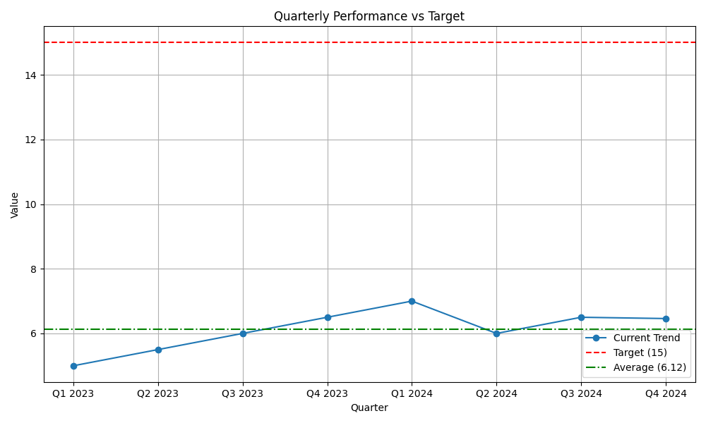

# Quarterly Performance Analysis

## Key Findings
Analysis of the quarterly performance data from Q1 2023 to Q4 2024 reveals the following:
- **Current Average:** The average performance value over the last 8 quarters is **6.12**.
- **Trend:** While there was a steady increase through 2023, peaking at 7.0 in Q1 2024, performance has since plateaued and fluctuated around the 6.0-6.5 range.
- **Gap to Target:** The current performance is significantly below the strategic target of 15. The gap indicates that incremental improvements are insufficient to reach the goal.

## Business Implications
- **Growth Stagnation:** The current trajectory suggests that the existing market or product lines have reached saturation or are facing stiff competition.
- **Risk of Missed Targets:** Continuing with the status quo will likely result in failing to meet the long-term target of 15, potentially impacting investor confidence and market share.
- **Operational Efficiency:** While stable, the current operations are not yielding the exponential growth required.

## Recommendations
To bridge the gap between the current average of 6.12 and the target of 15, we recommend the following:

1.  **Expand into New Market Segments:** This is the primary solution. We must identify and enter adjacent markets where our core competencies can be leveraged for rapid growth. This could involve geographic expansion or targeting new customer demographics.
2.  **Product Innovation:** Launch new features or products specifically designed for these new segments.
3.  **Strategic Partnerships:** Collaborate with established players in the new segments to accelerate market entry.

## Data Visualization
The chart below illustrates the quarterly performance trend against the target.

## Verification
- **Calculated Average:** 6.12
- **Author:** 24f2004315@ds.study.iitm.ac.in

## Tools Used
- **AI Assistant:** Jules (ChatGPT Codex)
- **Task URL:** https://chatgpt.com/codex/tasks
